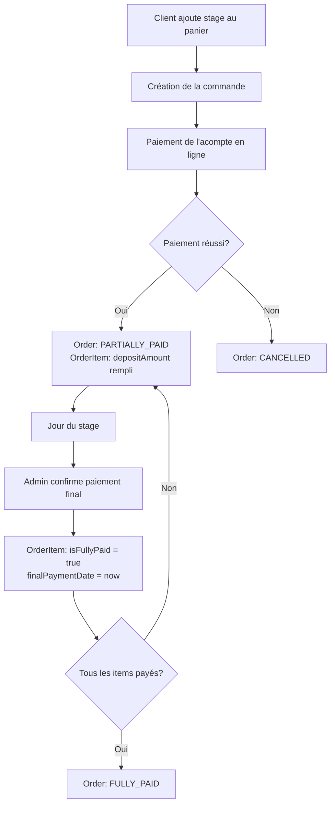
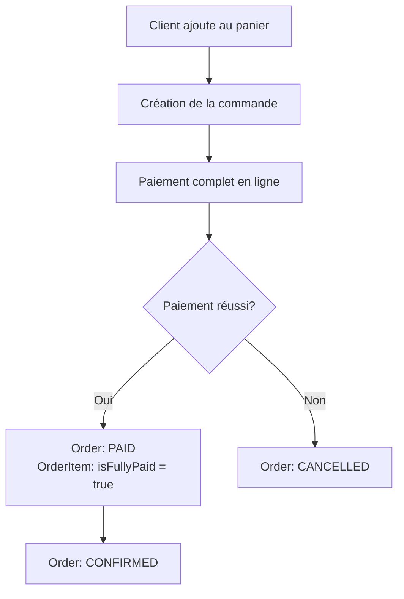

# Spécification : Gestion des Paiements Partiels pour les Stages

## 📋 Contexte

Les stages nécessitent un paiement en deux temps :
1. **Acompte** : Payé en ligne lors de la réservation
2. **Solde** : Payé en physique le jour du stage

Actuellement, le système ne permet pas de :
- Distinguer l'acompte du prix total dans les OrderItems
- Marquer qu'un stage a été partiellement payé
- Confirmer le paiement final en physique

## 🎯 Objectifs

1. Stocker séparément l'acompte et le montant total pour chaque OrderItem de type STAGE
2. Ajouter des statuts pour différencier les paiements partiels et complets
3. Permettre aux admins de confirmer le paiement final en physique
4. Afficher clairement le reste à payer sur toutes les interfaces

## 🗄️ Modifications du Schéma Prisma

### 1. Nouveaux statuts dans OrderStatus

```prisma
enum OrderStatus {
  PENDING        // Commande créée, en attente de paiement
  PAID           // Acompte payé (stages) ou paiement complet (baptêmes/bons cadeaux)
  PARTIALLY_PAID // Nouveau : Acompte payé mais reste à payer (stages uniquement)
  FULLY_PAID     // Nouveau : Tout est payé (stages)
  CONFIRMED      // Commande confirmée et traitée
  CANCELLED      // Commande annulée
  REFUNDED       // Commande remboursée
}
```

### 2. Nouveaux champs dans OrderItem

```prisma
model OrderItem {
  // ... champs existants ...
  
  // Nouveaux champs pour la gestion des acomptes (stages uniquement)
  depositAmount    Float?    // Montant de l'acompte payé (pour les stages)
  remainingAmount  Float?    // Montant restant à payer (pour les stages)
  isFullyPaid      Boolean   @default(false) // True quand tout est payé
  finalPaymentDate DateTime? // Date du paiement final en physique
  finalPaymentNote String?   // Note optionnelle sur le paiement final
}
```

## 🔄 Flux de Paiement

### Workflow pour un Stage



### Workflow pour un Baptême/Bon Cadeau



## 🛠️ Implémentation Technique

### 1. Modification du Schéma Prisma

**Fichier:** `prisma/schema.prisma`

- Ajouter `PARTIALLY_PAID` et `FULLY_PAID` à l'enum `OrderStatus`
- Ajouter les champs `depositAmount`, `remainingAmount`, `isFullyPaid`, `finalPaymentDate`, `finalPaymentNote` au modèle `OrderItem`

### 2. Migration de la Base de Données

```bash
npx prisma migrate dev --name add_partial_payment_support
```

### 3. Mise à Jour de la Création de Commande

**Fichier:** `src/features/orders/server/route.ts`

Dans l'endpoint `/create`, lors de la création des OrderItems :

```typescript
// Pour les stages
if (item.type === 'STAGE' && item.stage) {
  const fullPrice = item.stage.price;
  const depositPrice = item.stage.acomptePrice;
  
  return {
    type: item.type,
    quantity: item.quantity,
    unitPrice: fullPrice, // Prix complet
    totalPrice: fullPrice * item.quantity,
    depositAmount: depositPrice * item.quantity, // Acompte
    remainingAmount: (fullPrice - depositPrice) * item.quantity, // Reste
    isFullyPaid: false,
    // ... autres champs
  };
}

// Pour les baptêmes et bons cadeaux
else {
  return {
    // ... champs existants
    isFullyPaid: true, // Paiement complet dès le départ
    depositAmount: null,
    remainingAmount: null,
  };
}
```

### 4. Mise à Jour du Webhook Stripe

**Fichier:** `src/app/api/webhooks/stripe/route.ts`

Dans `handlePaymentSuccess`, déterminer le statut de la commande :

```typescript
// Vérifier si la commande contient des stages
const hasStages = order.orderItems.some(item => item.type === 'STAGE');
const hasRemainingAmount = order.orderItems.some(item => 
  item.remainingAmount && item.remainingAmount > 0
);

const newStatus = hasStages && hasRemainingAmount 
  ? 'PARTIALLY_PAID' 
  : 'PAID';

await prisma.order.update({
  where: { id: orderId },
  data: {
    status: newStatus,
    ...(client && { clientId: client.id }),
  },
});
```

### 5. Endpoint de Confirmation de Paiement Final

**Fichier:** `src/features/orders/server/route.ts`

Nouvel endpoint POST `/confirmFinalPayment/:orderItemId` :

```typescript
.post(
  "/confirmFinalPayment/:orderItemId",
  adminSessionMiddleware,
  zValidator("json", z.object({
    note: z.string().optional(),
  })),
  async (c) => {
    const orderItemId = c.req.param("orderItemId");
    const { note } = c.req.valid("json");
    
    // 1. Vérifier que l'OrderItem existe et est un stage
    // 2. Vérifier qu'il n'est pas déjà fully paid
    // 3. Mettre à jour isFullyPaid, finalPaymentDate, finalPaymentNote
    // 4. Vérifier si tous les items de la commande sont fully paid
    // 5. Si oui, mettre à jour le statut de la commande à FULLY_PAID
  }
)
```

### 6. Interface Utilisateur

#### Page des Réservations

**Fichier:** `src/app/(post-auth)/dashboard/reservations/reservations-view.tsx`

Pour chaque réservation de stage :
- Afficher le montant total, l'acompte payé et le reste à payer
- Badge de statut : "Acompte payé" ou "Entièrement payé"
- Bouton "Confirmer paiement final" si `!isFullyPaid`

#### Page des Commandes

**Fichier:** `src/app/(post-auth)/dashboard/commandes/orders-list.tsx`

Dans le tableau :
- Colonne "Montant" : Afficher "X€ / Y€" si paiement partiel
- Badge de statut adapté : PARTIALLY_PAID, FULLY_PAID, etc.
- Indicateur visuel du reste à payer

## 📊 Calculs Automatiques

### Au niveau OrderItem

```typescript
// Calculé automatiquement
const paidAmount = item.depositAmount || item.totalPrice;
const remainingAmount = item.isFullyPaid 
  ? 0 
  : (item.remainingAmount || 0);
```

### Au niveau Order

```typescript
// Somme des montants restants de tous les OrderItems
const orderRemainingAmount = order.orderItems.reduce(
  (sum, item) => sum + (item.remainingAmount || 0),
  0
);

// Statut calculé
const orderStatus = orderRemainingAmount > 0 
  ? 'PARTIALLY_PAID' 
  : 'FULLY_PAID';
```

## 🎨 Affichage UI

### Badges de Statut

- **PENDING** : Jaune - "En attente"
- **PAID** : Vert - "Payé"
- **PARTIALLY_PAID** : Orange - "Acompte payé"
- **FULLY_PAID** : Vert foncé - "Entièrement payé"
- **CONFIRMED** : Bleu - "Confirmé"
- **CANCELLED** : Rouge - "Annulé"
- **REFUNDED** : Gris - "Remboursé"

### Indicateurs de Paiement

Pour les stages avec paiement partiel :
```
💰 150€ / 350€ payés
⏳ Reste à payer : 200€
📅 À régler le jour du stage
```

## 🔐 Sécurité et Validation

1. **Seuls les admins** peuvent confirmer les paiements finaux
2. **Vérification** que l'OrderItem est bien un stage
3. **Prévention** des doubles confirmations (vérifier `isFullyPaid`)
4. **Historique** : Conserver la date et une note optionnelle

## 📝 Notes d'Implémentation

1. **Rétrocompatibilité** : Les commandes existantes sans `depositAmount` utiliseront `totalPrice`
2. **Migration** : Pas besoin de migrer les données existantes, les nouveaux champs sont optionnels
3. **Calculs** : Toujours vérifier si les champs sont null avant de les utiliser
4. **UI** : Afficher clairement la différence entre acompte et paiement complet

## ✅ Checklist d'Implémentation

- [ ] Modifier le schéma Prisma (OrderStatus + OrderItem)
- [ ] Exécuter la migration Prisma
- [ ] Mettre à jour la création de commande (orders/route.ts)
- [ ] Mettre à jour le webhook Stripe (webhooks/stripe/route.ts)
- [ ] Créer l'endpoint de confirmation de paiement final
- [ ] Créer le hook React Query
- [ ] Mettre à jour la page des réservations
- [ ] Mettre à jour la page des commandes
- [ ] Tester le flux complet
- [ ] Documenter les changements

## 🚀 Prochaines Étapes

Une fois cette spécification validée, basculer en mode Code pour l'implémentation.